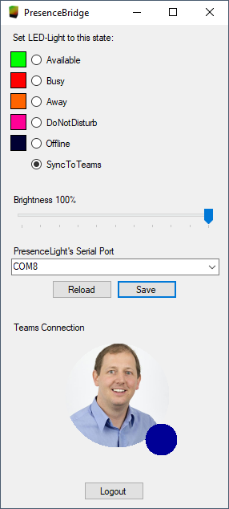

# PresenceBridge
Controlls LED-Light through serial port and synchronizes with Teams Status.
The serial protocol is very simple and a Light such as the
[LyncDisplayLight](https://github.com/grafmar/LyncDisplayLight) can easily
be build up.

## Connecting HW
The HW it is designed for is the [LyncDisplayLight](https://github.com/grafmar/LyncDisplayLight).
This is a RGB-LED with a display which can be controlled by the virtual serial port on its USB
connection.

The serial connection is configrued with 115200baud, 1 stop-bit, no parity. The commands used to
control the light are:

`rgb:255,255,0\n`

`callerid:John Doe\n`

## Configuration
 

Any configuration made is directly active. To save the configuration for the next time starting the
application the save button has to be pressed. The stored configuration can be reload using the
reload button. This sets the configuration again from the config file.

### Serial Port
Everytime the dropdown list is shown the available ports are scaned and displayed. When selecting
another port it is directly used.

### LED colors
The colors shown on the LED-Light can be configured. To do so click on the color of the Availability
to configure.

### Brightness
withe the brightness slider the brightness of the LED-Light can be adapted for all colors from 0%
to 100%.

### Teams Connection
To connect to your Teams account click on `Login`. This will open a browser window to log in. To
logout click on `Logout`

## Author
[Marco Graf](https://github.com/grafmar)

## Credits / Attribution
* Partially used code from [Isaac Levin](https://github.com/isaacrlevin); [presencelight](https://github.com/isaacrlevin/presencelight)
